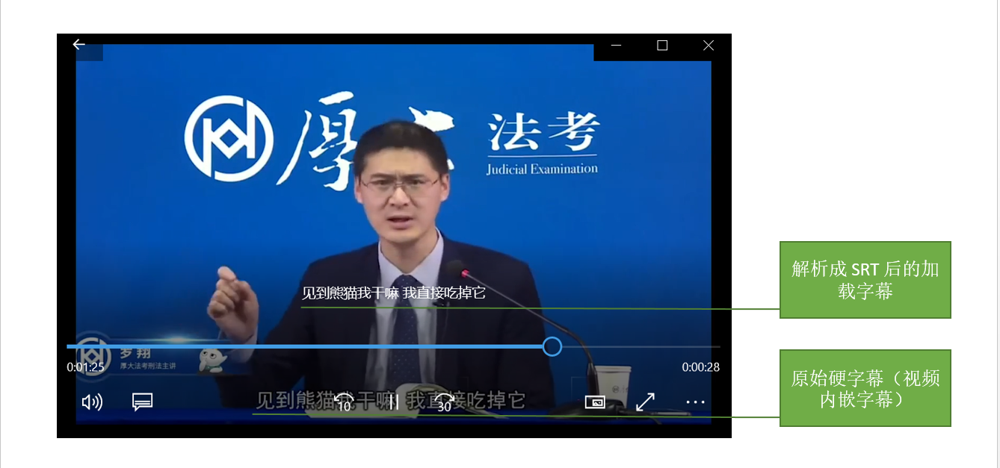

# WeSubtitle: 用 OCR 提取视频硬字幕

绝大多数中文视频中的字幕为硬字幕（嵌入到视频中的字幕），很多时候我们需要提取该字幕使用，
例如将字幕数字化、用字幕文本和对应时间段语音做语音识别等等。


## 示例

假设你的输入视频为 `input.mp4`，要生成的字幕文件为 `output.srt`，则使用以下命令运行：

``` sh
wesubtitle input.mp4 output.srt
```

运行命令时，你也可以额外指定以下参数：

* -s: 例如 `-s 3`，该参数指定处理时的跳帧数，跳帧越大，速度越快，字幕检测和时间精度会相应降低。
* -t: 例如 `-t 0.8`，该参数指定相似度参数，用于判定字幕区域是否发生变化。

处理完成后，你可以在视频播放器中打开视频并加载 `output.srt`，演示效果如下：



如果你没有视频，可以使用以下视频进行测试，
* 罗翔大熊猫：链接: https://pan.baidu.com/s/17VvHVUqYn8QW4v51emzyRw 提取码: tknf。


## 安装

``` sh
pip install git+https://github.com/wenet-e2e/wesubtitle.git
```


## 原理

目前我们假设字幕为横排字幕，且位于视频的下三分之一处。
未来会引入语音识别，根据语音识别结果和 OCR 的结果来综合做更准确的字幕定位。


## 常见问题
